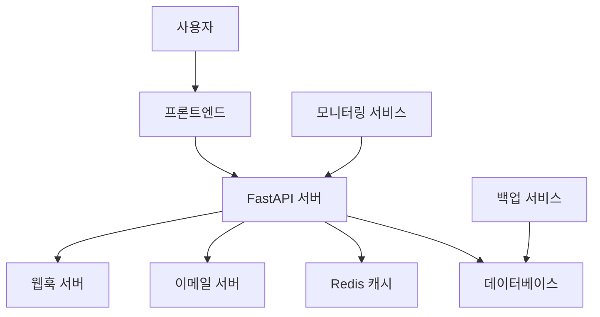
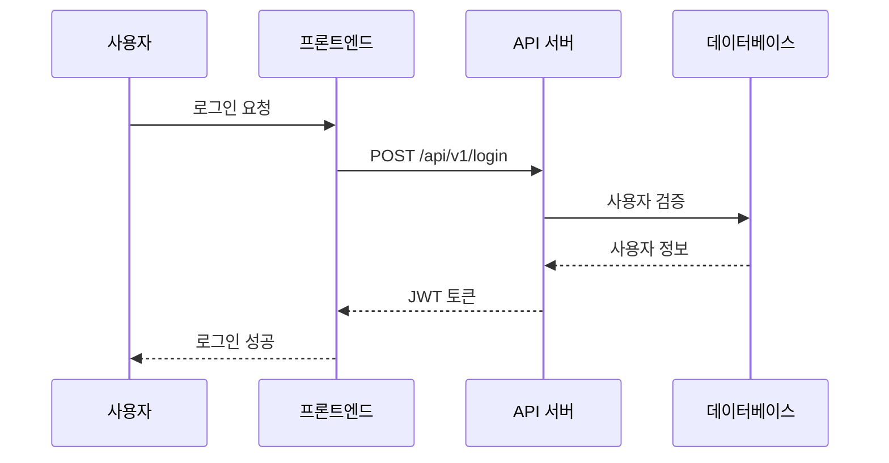
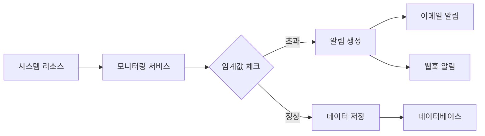
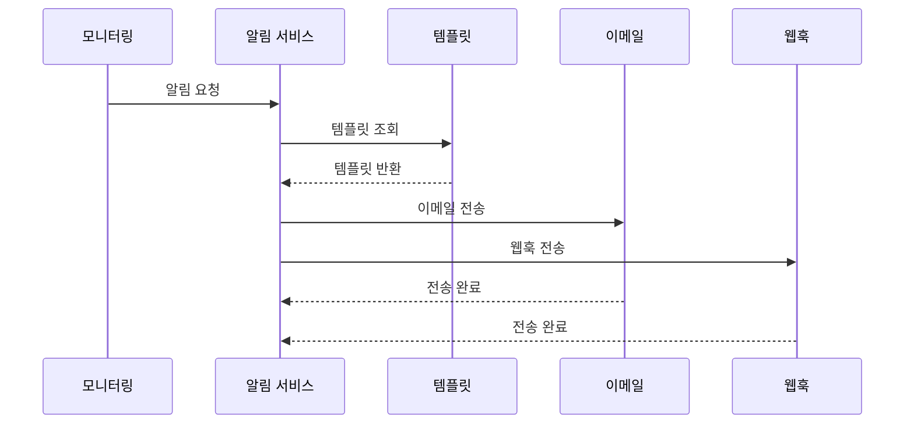
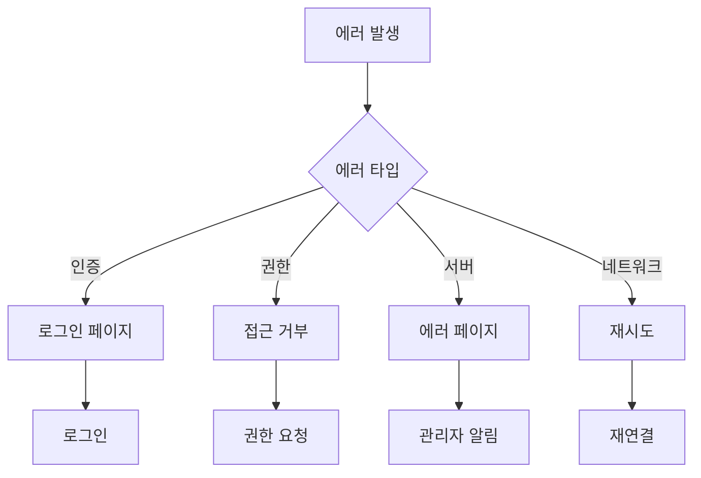
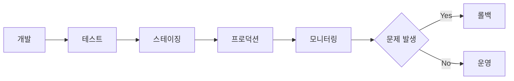

# 프로젝트 흐름도

## 1. 시스템 아키텍처 흐름도

## 2. 사용자 인증 흐름

## 3. 모니터링 프로세스 흐름

## 4. 알림 시스템 흐름

## 5. 데이터 처리 흐름

### 5.1 데이터 수집
1. 시스템 리소스 모니터링
   - CPU 사용량
   - 메모리 사용량
   - 디스크 사용량
   - 네트워크 트래픽

2. 데이터 정규화
   - 단위 변환
   - 데이터 포맷팅
   - 이상치 제거

3. 데이터 저장
   - 실시간 데이터: Redis
   - 히스토리 데이터: PostgreSQL

### 5.2 데이터 분석
1. 실시간 분석
   - 임계값 비교
   - 트렌드 분석
   - 이상 감지

2. 히스토리 분석
   - 일간/주간/월간 통계
   - 성능 추이 분석
   - 리소스 사용 패턴

## 6. 프론트엔드 흐름

### 6.1 페이지 로드
1. 초기 로드
   - 인증 상태 확인
   - 기본 데이터 로드
   - UI 렌더링

2. 실시간 업데이트
   - WebSocket 연결
   - 데이터 구독
   - UI 업데이트

### 6.2 사용자 인터랙션
1. 데이터 조회
   - 필터링
   - 정렬
   - 페이지네이션

2. 설정 변경
   - 알림 설정
   - 임계값 설정
   - UI 설정

## 7. 백엔드 API 흐름

### 7.1 요청 처리
1. 인증/인가
   - JWT 토큰 검증
   - 권한 확인
   - 요청 유효성 검사

2. 비즈니스 로직
   - 데이터 처리
   - 비즈니스 규칙 적용
   - 결과 생성

3. 응답 생성
   - 데이터 직렬화
   - 에러 처리
   - 응답 전송

### 7.2 비동기 작업
1. 백그라운드 작업
   - 데이터 백업
   - 리포트 생성
   - 알림 전송

2. 스케줄링
   - 주기적 작업
   - 일회성 작업
   - 작업 우선순위

## 8. 에러 처리 흐름

## 9. 배포 흐름

